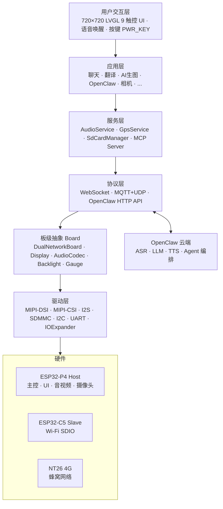
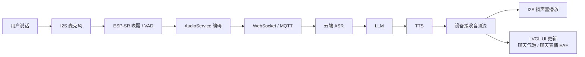
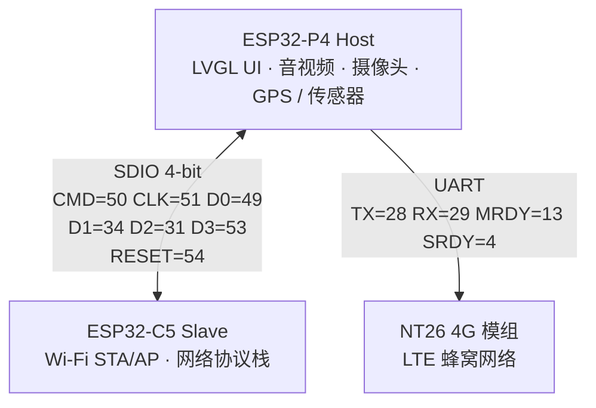
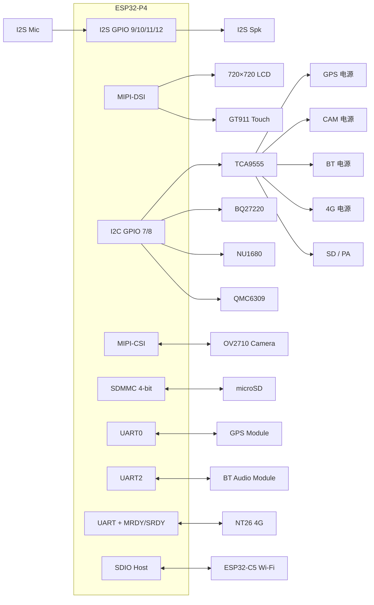
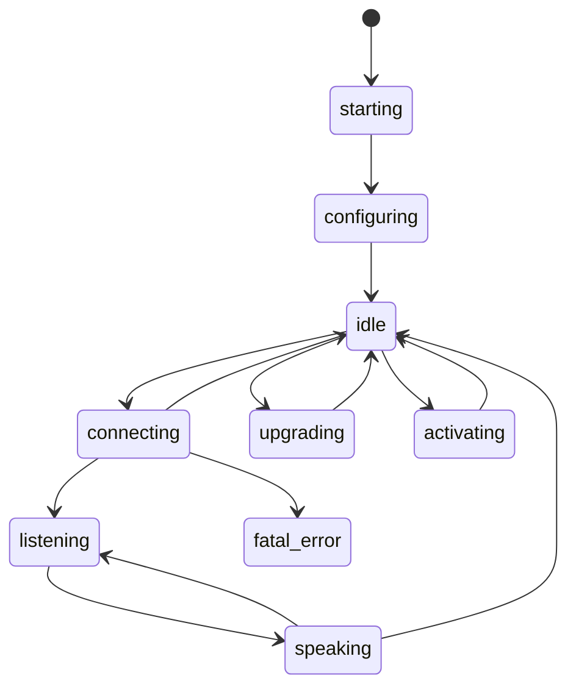
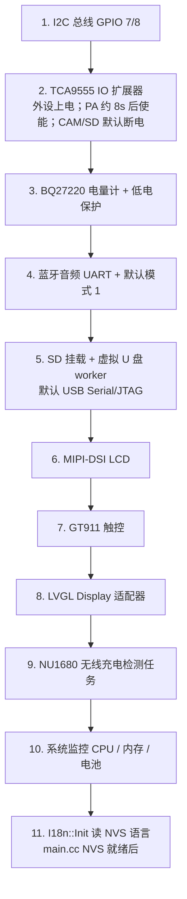

# Metalio Claw4

<p align="center">
  
</p>

**中文** | [English](README.md)

**快速链接**

- 固件仓库：[CloudZao/MetalioClaw4](https://github.com/CloudZao/MetalioClaw4)
- 上游架构：[小智 AI (xiaozhi-esp32)](https://github.com/78/xiaozhi-esp32)
- ESP-IDF 官方文档：[ESP32-P4 快速入门 v5.5.4](https://docs.espressif.com/projects/esp-idf/zh_CN/v5.5.4/esp32p4/get-started/index.html)

---

## 目录

1. [产品概述](#1-产品概述)
2. [核心特性](#2-核心特性)
3. [应用场景](#3-应用场景)
4. [系统架构](#4-系统架构)
5. [硬件规格](#5-硬件规格)
6. [双芯架构](#6-双芯架构)
7. [外设与引脚](#7-外设与引脚)
8. [原理图说明](#8-原理图说明)
9. [软件架构](#9-软件架构)
10. [OpenClaw](#10-openclaw)
11. [内置应用](#11-内置应用)
12. [通信协议](#12-通信协议)
13. [开发环境](#13-开发环境)
14. [编译与烧录](#14-编译与烧录)
15. [调试与常见问题](#15-调试与常见问题)

> 近期补充：**翻译**、**AI 生图**、**聊天打断/菜单**、**唤醒词会话持有**、**OTA 默认 URL 写 NVS**、**UI 多语言**、**待机屏**、**SD 虚拟 U 盘** 等，见对应章节。

---

## 1. 产品概述

**Metalio Claw4** 是一款面向开发者与创客的开源便携 AI 实体设备。整机约 **8×8 cm** 掌心大小，集成 3.95 寸 720×720 触控屏、麦克风阵列、扬声器、摄像头、GPS、无线充电与双模联网能力，可在离线唤醒后通过语音与云端 AI 交互。

| 属性        | 说明                                                  |
|:--------- |:--------------------------------------------------- |
| **产品名称**  | Metalio Claw4                                       |
| **主控芯片**  | ESP32-P4（双核 RISC-V，480 MHz；Flash 32 MB，PSRAM 32 MB） |
| **协处理器**  | ESP32-C5（2.4 / 5 GHz Wi-Fi，经 ESP-Hosted SDIO）       |
| **4G 模组** | NT26（4G LTE）；出厂内置 4G 贴片卡，支持外置 SIM                   |
| **屏幕**    | 3.95 寸 MIPI-DSI，720×720，GT911 电容触控                  |

---

## 2. 核心特性

### 2.1 AI 语音交互

- **离线唤醒**：基于 ESP-SR 唤醒词
- **流式 ASR / LLM / TTS**：实时语音识别、大模型推理与语音合成
- **设备端 AEC**：回声消除，支持全双工对话
- **双协议上云**：WebSocket 或 MQTT+UDP，灵活对接不同后端

### 2.2 内置OpenClaw Agent

**OpenClaw** 是 Metalio Claw4 搭载的云端 AI Agent 平台。用户通过主屏 **OpenClaw App** 用自然语言与云端 Agent 多轮对话。

- **语音对话**：按住说话发送指令，与云端 Agent 多轮交互
- **会话管理**：支持历史会话查看与清空

API 与设备端能力详见 [§10 OpenClaw](#10-openclaw)。

### 2.3 多模态感知

- **拍照预览**：OV2710 MIPI-CSI 摄像头，**200 万像素**（1920×1080），在「相机」App 中实时预览与拍照

### 2.4 连接能力

- **Wi-Fi**：ESP32-C5 协处理器经 SDIO 连接，支持 **2.4 GHz** 与 **5 GHz** 双频 Wi-Fi
- **4G LTE**：NT26 蜂窝模组，出厂已内置 **4G 贴片卡**；支持 **内置卡 / 外置卡** 双卡槽（见下文）
- **蓝牙音频**：专业蓝牙音频芯片，一套硬件兼顾语音 Codec、蓝牙音箱与蓝牙耳机连接（见 [§12.1](#121-蓝牙音频与三种模式)）
- **虚拟 U 盘**：在「SD 卡」App 中可将 microSD 以 USB MSC 形式暴露给电脑（与 USB Serial/JTAG **共用 GPIO24/25，互斥**；详见 [§14.6](#146-sd-卡资源与虚拟-u-盘)）

#### 4G 与 SIM 卡

Metalio Claw4 **出厂已内置 4G 贴片卡**（内置卡），NT26 模组同时提供 **外置 SIM 卡槽**，用户也可自行安装外置卡。在 **4G 网络模式** 下，可在「网络配置」App 的 **SIM 卡切换** 页于内置卡与外置卡之间切换；首页状态栏会显示当前使用的「内置卡」或「外置卡」。

| SIM 类型                 | 说明                    | 能否打电话 |
|:---------------------- |:--------------------- |:-----:|
| **内置卡**（贴片卡，SimSlot=1） | 出厂预装，主要用于 **4G 数据联网** | ❌ 不支持 |
| **外置卡**（SimSlot=0）     | 用户自行插入的标准 SIM 卡       | ✅ 支持  |

- **4G 联网**：内置卡、外置卡均可用于蜂窝数据（需在「网络配置」中切换到 4G 模式）

#### 专业蓝牙音频方案

Metalio Claw4 以 **专业蓝牙音频芯片** 替代 ES8311 + ES7210 分立方案，一套硬件覆盖三种用法：**日常小智对话**（模式 1）、**连接蓝牙耳机/音箱对话**（模式 2）、**手机连本机当音箱**（模式 3）。模式切换、操作步骤与 AT 指令详见 [§12.1 蓝牙音频与三种模式](#121-蓝牙音频与三种模式)。

### 2.5 电源与续航

- **单节锂电** + TI BQ27220 电量计（I2C 0x55）
- **无线充电**：NU1680 接收芯片（I2C 0x60），支持 Qi 无线充电，可通过寄存器 [配置充电电流](#nu1680-充电电流控制)
- **USB 充电检测**：IO 扩展器 USB_INSERT_DET 引脚
- **低电量保护**：开机 0% 且未充电时自动关机
- **待机与关机（可配置）**：停留在**首页**时，空闲策略由「设置 → 待机」控制（见 `idle_power_policy`）：
  - **进入待机**：默认约 **1 分钟**无操作进入 `standby_screen`（大号时钟；插上充电会播放蓝色粒子特效约 10 秒）
  - **累计关机**：默认约 **5 分钟**（首页 + 待机累计无操作）后软件关机；任一滑块设为 **0** 表示禁用该项
  - 进入其他 App 后空闲计时停止；任意触控会重置计时。侧键短按仅在**前台为首页**时进入待机
- **开关机芯片**：硬件长按约 **1 秒**开机、**5 秒**强制关机；固件经 IO 扩展器发送脉冲可软件关机（见 [下文](#开关机芯片与电源键)）

#### 开关机芯片与电源键

Metalio Claw4 的电源通断由专用**开关机芯片**管理，与主控 MCU 相对独立。机身电源键同时接入开关机芯片与 TCA9555 IO 扩展器：MCU 通过 `PWR_KEY` 读取按键状态，通过 `PWR_KEY_PULSE` 向开关机芯片输出模拟按键脉冲。

| 操作                        | 方式  | 说明                         |
|:------------------------- |:---:|:-------------------------- |
| 关机状态下长按电源键约 **1 秒**       | 硬件  | 开关机芯片上电，设备开机               |
| 开机状态下长按电源键约 **5 秒**       | 硬件  | 开关机芯片强制断电，不依赖固件            |
| 软件发送 **PWR_KEY_PULSE** 脉冲 | 固件  | 经 TCA9555 P0-4 模拟短按，直接触发关机 |

**固件侧引脚**（详见 [§7.3](#73-tca9555-io-扩展器i2c-16-bit)）：

| 信号              | TCA9555 | 方向  | 作用             |
|:--------------- |:-------:|:---:|:-------------- |
| `PWR_KEY`       | P0-5    | IN  | 读取用户按压电源键      |
| `PWR_KEY_PULSE` | P0-4    | OUT | 向开关机芯片输出模拟按键脉冲 |

固件关机时向 `PWR_KEY_PULSE` **持续**发送脉冲：**高电平 100 ms / 低电平 100 ms 循环**，直到开关机芯片断电（任务随电源切断自然结束）。用于 UI「关机」、低电量保护、主屏待机关机等场景。相关逻辑见 `home_screen.cc`（`PwrShutdownPulseTask`）与 `metalio-claw-4.cc`（开机电量保护）。

设备已开机时，固件检测到 `PWR_KEY` 长按约 **1.5 秒**会弹出「重启 / 关机」对话框；选择关机后同样走上述持续脉冲。电源对话框底部亦提示：**长按电源键 5 秒可强制关机**（硬件行为）。

#### NU1680 充电电流控制

NU1680 通过 I2C 寄存器 **0x1E**（`MTP_ILIM_SET`）的低 3 位 **[2:0]** 设置过流保护限流值（R/W，复位默认 `0x00`）。写入时**仅修改 [2:0]，高 5 位保持不变**。

| [2:0] | 限流电流    |
|:-----:|:-------:|
| `000` | 1.4 A   |
| `001` | 1.65 A  |
| `010` | 1.1 A   |
| `011` | 0.74 A  |
| `100` | 0.365 A |
| `101` | 0.45 A  |
| `110` | 0.29 A  |
| `111` | 0.215 A |

固件在检测到 NU1680 在线（I2C 0x60）时，默认向 `0x1E` 写入 `0x00`（**1.4 A**），并向 `0x15` 写入 `0x00` 关闭温度保护。相关逻辑见 `main/boards/metalio-claw-4/metalio-claw-4.cc`。

---

## 3. 应用场景

Metalio Claw4 自带一组内置 App，开发者可基于现有硬件与软件能力**组合、裁剪或二次开发**，将 App 拓展为不同的垂直场景。下表仅为**示例引用**，并非出厂固定形态：

| 场景（示例）   | 可组合的相关 App / 能力                   |
|:-------- |:--------------------------------- |
| **拍照学习** | 相机、SD 卡资源管理                   |
| **会议记录** | 聊天、OpenClaw、蓝牙音频                  |
| **同声传译** | 翻译（Sonicloud 实时识别 / 译文） |
| **创意生图** | AI 生图（语音描述 → 文生图） |
| **智能中控** | 语音对话 + MCP 协议控制 IoT 设备            |
| **户外导航** | GPS 硬件服务、4G 联网 |
| **休闲娱乐** | 蓝牙音箱模式、2048 |
| **开发调试** | 引脚测试、系统信息、厂测硬件检查                |

---

## 4. 系统架构



### 4.1 数据流（语音对话）



---

## 5. 硬件规格

| 类别      | 规格                                                                       |
|:------- |:------------------------------------------------------------------------ |
| **尺寸**  | 约 8×8 cm（掌心大小）                                                           |
| **主控**  | ESP32-P4，双核 RISC-V 480 MHz；Flash 32 MB，PSRAM 32 MB                       |
| **存储**  | 板载 32 MB Flash（分区表见 `partitions/`）+ microSD 卡槽                           |
| **屏幕**  | 3.95 寸方形 MIPI-DSI，720×720，24 bpp                                         |
| **触控**  | GT911 电容触控（I2C）                                                          |
| **音频**  | 专业蓝牙音频芯片（替代 ES8311 + ES7210）；I2S 麦克风/扬声器 16 kHz；兼作 Codec / 蓝牙音箱 / 蓝牙耳机连接 |
| **摄像头** | OV2710，MIPI-CSI，200 万像素（1920×1080 @ 25fps），24 MHz XCLK                   |
| **定位**  | GPS 模组（UART NMEA-0183，9600 baud）                                         |
| **传感器** | SC7A20HTR（三轴加速度计）        QMC6309（三轴磁传感器）                                 |
| **网络**  | 2.4 / 5 GHz Wi-Fi（ESP32-C5）+ 4G LTE（NT26）；出厂内置 4G 贴片卡，支持外置 SIM           |
| **蓝牙**  | 专业蓝牙音频芯片（UART 115200，AT 指令）；详见 [§12.1](#121-蓝牙音频与三种模式)                   |
| **电源**  | 单节锂电池 + BQ27220 电量计                                                      |
| **充电**  | USB 有线充电 + Qi 无线充电（[NU1680](#nu1680-充电电流控制)）                             |
| **震动**  | 震动马达（GPIO 22，LEDC PWM）                                                     |
| **按键**  | 电源键（`PWR_KEY` / `PWR_KEY_PULSE`，经 IO 扩展器；见 [开关机芯片](#开关机芯片与电源键)）          |

---

## 6. 双芯架构

Metalio Claw4 采用 **ESP32-P4 + ESP32-C5** 异构双芯设计，通过乐鑫 **ESP-Hosted** 框架通信：



| 芯片           | 角色         | 接口               | 职责                                           |
|:------------ |:---------- |:---------------- |:-------------------------------------------- |
| **ESP32-P4** | Host 主控    | —                | UI、音频、摄像头、GPS、SD 卡、协议、OpenClaw / MCP         |
| **ESP32-C5** | Slave 协处理器 | SDIO Slot 1      | 2.4 / 5 GHz Wi-Fi 连接、网络协议栈（经 ESP-Hosted RPC） |
| **NT26**     | 蜂窝模组       | UART + MRDY/SRDY | 4G LTE 数据，与 Wi-Fi 可切换                        |

> P4 本身不含 Wi-Fi 射频，因此需要 C5 协处理器；Wi-Fi 与 4G 由 `DualNetworkBoard` 统一管理，用户可在「网络配置」App 中切换。

---

## 7. 外设与引脚

引脚定义源文件：`main/boards/metalio-claw-4/config.h`  
IO 扩展器映射源文件：`main/boards/common/IOExpander.hpp`  
P4 ↔ C5 SDIO 引脚：`sdkconfig` 中 `CONFIG_ESP_HOSTED_SDIO_*`（P4 Host 侧可配置；C5 Slave 侧为固定 IOMUX）

### 7.1 ESP32-P4 直接 GPIO

| 功能              | GPIO  | 说明                                        |
|:--------------- |:-----:|:----------------------------------------- |
| I2C SDA         | 7     | 共享总线：GT911、TCA9555、BQ27220、QMC6309、NU1680 |
| I2C SCL         | 8     |                                           |
| I2S 麦克风 WS      | 10    | 音频输入                                      |
| I2S 麦克风 DIN     | 11    |                                           |
| I2S 扬声器 BCLK    | 12    | 音频输出                                      |
| I2S 扬声器 DOUT    | 9     |                                           |
| NT26 SRDY       | 4     | 4G 模组流控                                   |
| NT26 MRDY       | 13    | 4G 模组流控                                   |
| NT26 TX → 模组 RX | 28    | UART                                      |
| NT26 RX ← 模组 TX | 29    | UART                                      |
| 摄像头 XCLK        | 32    | 24 MHz 时钟输出                               |
| GPS TX → 模组 RX  | 38    | UART0                                     |
| GPS RX ← 模组 TX  | 37    | UART0                                     |
| Boot 按键         | 35    |                                           |
| BT 音频 TX        | 26    | UART2, 115200                             |
| BT 音频 RX        | 27    |                                           |
| LCD 复位          | 3     | 与摄像头共享复位线                                 |
| 背光 PWM          | 52    |                                           |
| SDMMC CLK       | 43    | 4-bit SD 卡                                |
| SDMMC CMD       | 44    |                                           |
| SDMMC D0–D3     | 39–42 |                                           |
| 震动马达          | 22    | LEDC PWM 控制                               |

### 7.2 ESP-Hosted SDIO（P4 ↔ C5）

Metalio Claw4 经 **SDIO Slot 1**、**4-bit** 总线连接 P4 与 C5（时钟 **40 MHz**）。P4 Host 侧引脚在 `sdkconfig` 中**自定义配置**（非 ESP-Hosted 默认 Slot 1 引脚）；C5 Slave 侧 SDIO 引脚由芯片 IOMUX **固定**，不可在软件中更改。

| 信号    | ESP32-P4 GPIO（Host） | ESP32-C5 GPIO（Slave） | 说明                             |
|:----- |:-------------------:|:--------------------:|:------------------------------ |
| CMD   | 50                  | 10                   |                                |
| CLK   | 51                  | 9                    |                                |
| D0    | 49                  | 8                    |                                |
| D1    | 34                  | 7                    |                                |
| D2    | 31                  | 14                   |                                |
| D3    | 53                  | 13                   |                                |
| RESET | 54                  | RST/EN               | P4 输出，**高电平有效**；每次 P4 启动时复位 C5 |

| 参数      | 值      | `sdkconfig` 配置项                               |
|:------- |:------ |:--------------------------------------------- |
| SDIO 槽位 | Slot 1 | `CONFIG_ESP_HOSTED_SDIO_SLOT_1`               |
| 总线宽度    | 4-bit  | `CONFIG_ESP_HOSTED_SDIO_4_BIT_BUS`            |
| 时钟频率    | 40 MHz | `CONFIG_ESP_HOSTED_SDIO_CLOCK_FREQ_KHZ=40000` |
| 复位极性    | 高电平有效  | `CONFIG_ESP_HOSTED_SDIO_RESET_ACTIVE_HIGH`    |

> P4 默认 Slot 1 引脚为 CLK=18 / CMD=19 / D0–D3=14–17。Metalio Claw4 因 PCB 布线改用上表引脚。修改 P4 侧引脚后需同步重新编译并烧录 **P4 主固件**与 **C5 协处理器固件**（C5 侧引脚须与硬件一致）。

### 7.3 TCA9555 IO 扩展器（I2C 16-bit）

| 逻辑引脚                | 硬件线  | 方向  | 功能                       |
|:------------------- |:----:|:---:|:------------------------ |
| GPS_POWER           | P0-0 | OUT | GPS 模组电源（**高电平使能**）      |
| PA_SWITCH           | P0-1 | OUT | 功放音源切换（低电平=4G, 高电平=WiFi） |
| CAM_PWDN            | P0-2 | OUT | 摄像头电源（**低电平使能**）         |
| SD                  | P0-3 | OUT | SD 卡电源（**低电平使能**）        |
| PWR_KEY_PULSE       | P0-4 | OUT | 向开关机芯片输出脉冲（软件关机）         |
| PWR_KEY             | P0-5 | IN  | 侧面电源键                    |
| BT_POWER            | P0-6 | OUT | 蓝牙芯片电源（**高电平使能**）        |
| RST_4G              | P0-7 | OUT | 4G 模组电源（**高电平使能**）       |
| PA                  | P1-0 | OUT | 音频功放使能（**高电平使能**）        |
| ACCEL_INT           | P1-1 | IN  | 加速度计中断                   |
| USB_INSERT_DET      | P1-2 | IN  | USB 插入检测                 |
| WIRELESS_CHARGE_DET | P1-3 | IN  | 无线充电检测                   |

### 7.4 I2C 设备地址

| 设备              | 7-bit 地址    | 说明                                        |
|:--------------- |:-----------:|:----------------------------------------- |
| GT911 触控        | 0x5D / 0x14 | 自动探测                                      |
| TCA9555 IO 扩展   | 0x20        | 16-bit                                    |
| BQ27220 电量计     | 0x55        | 单节锂电                                      |
| NU1680 无线充电     | 0x60        | Qi 接收器；[`0x1E[2:0]` 限流设置](#nu1680-充电电流控制) |
| QMC6309 磁力计     | 0x7C        | 三轴                                        |
| OV2710 摄像头 SCCB | 0x36        | MIPI-CSI                                  |

### 7.5 外设框图



---

## 8. 原理图说明

---

## 9. 软件架构

Metalio Claw4 固件基于 [小智 AI (xiaozhi-esp32)](https://github.com/78/xiaozhi-esp32) 架构，为 `metalio-claw-4` 板级定制。

### 9.1 分层结构

| 层级       | 目录 / 模块                   | 职责                         |
|:-------- |:------------------------- |:-------------------------- |
| **入口**   | `main.cc` → `Application` | 启动、事件循环、状态机                |
| **板级**   | `boards/metalio-claw-4/`  | 硬件初始化、引脚配置                 |
| **显示**   | `display/screen/*`        | LVGL 9 各 App 页面            |
| **音频**   | `audio/`                  | 编解码、唤醒词、AEC                |
| **协议**   | `protocols/`              | WebSocket、MQTT+UDP         |
| **MCP**  | `mcp_server.cc`           | 设备端 Model Context Protocol |
| **UI 多语言** | `main/i18n/`            | 运行时中/英切换（`catalog.json` → `I18n::T`）；设置「语言」Tab，NVS 持久化 |
| **通用驱动** | `boards/common/`          | GPS、SD 卡、电量计、IO 扩展、双网、虚拟 U 盘（`usb_virtual_disk`） |

### 9.2 状态机

`Application` 维护设备状态：



- **idle**：待机；**仅聊天页前台时**才会持有唤醒词引擎（`SetVoiceUiDesired`），回桌面后释放，降低空闲 CPU
- **listening**：录音中，流式上传 ASR
- **speaking**：播放 TTS 回复
- **OTA URL**：启动时若 NVS `wifi/ota_url` 为空，写入默认 `https://api.tenclass.net/xiaozhi/ota/`；已有值则沿用
- **connecting**：建立 WebSocket / MQTT 连接

### 9.3 板级初始化顺序

`metalio-claw-4.cc` 构造函数中的初始化序列：



### 9.4 项目目录结构

```
main/
├── application.cc              # 启动、状态机、协议调度
├── i18n/                       # 运行时 UI 多语言（catalog.json）
├── boards/metalio-claw-4/      # Metalio Claw4 板级初始化
│   ├── config.h                # GPIO 引脚、屏参
│   ├── config.json             # 构建配置
│   └── metalio-claw-4.cc       # 板级启动入口
├── display/screen/             # LVGL 各功能 App（含 settings / standby / test / sd_card）
├── audio/                      # 录音、播放、唤醒词
├── protocols/                  # WebSocket / MQTT 协议
└── boards/common/              # 通用驱动（GPS、SD、电量计、usb_virtual_disk 等）

```

---

## 10. OpenClaw

OpenClaw 是 Metalio 云端 AI Agent 平台，设备通过 HTTP API 与其通信：

| API  | 路径                                         | 用途          |
|:---- |:------------------------------------------ |:----------- |
| 设备状态 | `GET /api/v1/devices/status`               | 上报 / 查询设备状态 |
| 会话列表 | `GET /api/v1/conversation?page=1&size=100` | 获取历史会话      |
| 消息记录 | `GET /api/v1/conversation/{id}/messages`   | 会话消息        |
| 清空会话 | `POST /api/v1/conversation/removeAll`      | 清除所有会话      |

API 基址定义于 `main/api_endpoints.h`。

设备端 **OpenClaw App**（`openclaw_screen`）提供：

- 按住说话发送语音指令
- 消息气泡展示
- 与云端 Agent 的对话

---

## 11. 内置应用

主屏 App 列表（`home_screen.cc` → `kApps[]`）：

| App | 标识 | 说明 |
|:---|:---|:---|
| 聊天 | chat | 小智 AI 语音对话；**文字气泡** / **EAF 表情**；菜单含打断开关（§11.1） |
| 网络配置 | wifi | Wi-Fi / 4G 切换、SIM 卡切换（内置卡 / 外置卡） |
| 日历 | calendar | 日历查看 |
| OpenClaw | openclaw | 云端 Agent 对话（§10） |
| 相机 | camera | OV2710 预览拍照（1920×1080） |
| 计算器 | calculator | 四则运算 |
| 天气 | weather | 城市天气查询 |
| SD 卡 | sd | 文件浏览 / 删除；**启用虚拟 U 盘**（§14.6） |
| 引脚测试 | pin | GPIO 测试 |
| 2048 | 2048 | 小游戏 |
| 系统信息 | info | 固件版本 / 芯片 / MAC |
| 测试 | test | 厂测入口：自动测试、压力测试、硬件测试等 |
| 设置 | settings | 音量 / 亮度 / 待机 / **语言（中英）** / 蓝牙 / 充电（有充电 IC 时）等 |
| AI 生图 | ai_image_gen | 语音描述 → 文生图，多图 Tab 与下载（§11.3） |
| 翻译 | translate | Sonicloud 实时同声传译（§11.2） |

#### 设置（settings）

- **语言**：运行时切换简体中文 / English（`I18n::SetLocale`，写入 NVS）；切换后重建主页生效
- **待机**：配置「进入待机」与「累计关机」时长（分钟，0=禁用）
- **蓝牙**：原独立「蓝牙配置」能力并入设置 Tab（模式 1/2/3、扫描配对、复位蓝牙）
- **充电**：检测到板载充电 IC（如 CX25601N）时显示电流档位；无芯片则隐藏该 Tab
- 音量、背光等亦在此调节（不再单独提供「屏幕亮度」主屏图标）

#### 测试（test）

厂测与压测入口（`test_screen`），常见子项包括：自动测试（含电量计 / 无线充电 / 摄像头等）、压力测试（LVGL + 背景音乐 + 马达 + 摄像头循环）、硬件相关测试。日常用户可忽略。

#### 11.1 聊天（chat）

- Header 右侧**下拉菜单**：表情 / 聊天模式切换、**打断（设备端 AEC）**开关、清空（仅聊天模式显示）
- **聊天模式**：左右文字气泡（助手/系统在左，用户在右）；背景为黑色
- **表情模式**：全屏居中播放 SD 卡 EAF，路径 `/sdcard/system/chat/{emotion}.eaf`（情绪名由服务端下发，需为合法 `[A-Za-z0-9_-]`）；底部白色字幕显示最新消息；点击 Header 区域可显隐顶栏
- **打断偏好**：写入 NVS，开机恢复；默认关。开启后在语音处理中启用设备端 AEC（全双工打断）
- **语音会话**：仅本页前台时持有唤醒词引擎（`SetVoiceUiDesired`）；回桌面后软停并延迟销毁 AFE，避免空闲占 CPU、反复进出崩溃
- 资源需放在 SD 卡对应目录；无卡或文件缺失时表情模式不可用

#### 11.2 翻译（translate）

- Sonicloud **实时同声传译**：按住说话识别原文，展示译文
- 需已连接 **Wi‑Fi**（未联网时拦截提示）；源/目标语言不可相同
- 依赖板端音频链路；忙或未就绪时有对应提示

#### 11.3 AI 生图（ai_image_gen）

- 语音描述 → 云端**文生图**；生成中显示已用时，完成后多图 Tab 浏览
- 支持下载到本地；需 **Wi‑Fi**（未联网时拦截）
- 底部按钮区与 Tab 交互；生成过程中相关滑动手势受限以免误触

---

## 12. 通信协议

| 协议                | 用途                  |
|:----------------- |:------------------- |
| **WebSocket**     | 流式语音对话（ASR/LLM/TTS） |
| **MQTT + UDP**    | 备选上云通道              |
| **MCP**           | 设备能力暴露给 LLM         |
| **OpenClaw HTTP** | 云端 Agent API        |
| **蓝牙 AT**         | BT 音频模组控制           |

### 12.1 蓝牙音频与三种模式

ESP32-P4 经 **UART**（115200，GPIO 26/27）向蓝牙芯片发送 **AT 指令**切换工作模式；硬件方案概述见 [§2.4](#专业蓝牙音频方案)。蓝牙 UART 与 `BT_POWER` 引脚见 [§7.1](#71-esp32-p4-直接-gpio) / [§7.3](#73-tca9555-io-扩展器i2c-16-bit)。

#### 模式概览

可以把蓝牙芯片的三种模式理解成三件事：**平时跟小智说话**、**连蓝牙耳机/音箱再说话**、**把手机当遥控器来放歌**。不用记 AT 指令，大部分切换固件都会自动帮你做。

**模式 1 — 日常小智对话（开机默认）**

设备**一开机就是模式 1**，也是平时最常用的状态。在这个模式下，蓝牙音频芯片走 I2S，负责小智的录音和播放，你直接语音唤醒、进「聊天」对话就行，不用额外设置。从模式 3 恢复时，在「设置 → 蓝牙」中手动切回模式 1。

**模式 2 — 连外置蓝牙设备，再跟小智说话**

需要配对新耳机、音箱，或者想用**蓝牙耳机 / 带麦蓝牙音箱**跟小智对话时，去首页打开「**设置**」→「**蓝牙**」Tab，点「**模式 2**」。然后可以扫描附近设备、点连接完成配对。连上之后，声音会从你配对的蓝牙设备进出——但注意，**外设必须有麦克风**（比如蓝牙耳机、带麦音箱），纯播放型蓝牙音箱没法拾音，就不能用来对话。用完想回到默认状态，在同一页手动点回「**模式 1**」。

**模式 3 — 蓝牙音箱，手机连本机放歌**

想用手机蓝牙连上 Metalio Claw4 当音箱听歌？按下面几步来就行：

1. 在设备首页打开「**设置**」→「**蓝牙**」，选择「**模式 3**」，设备进入「等你来连」的音箱状态。
2. 拿出手机，打开**系统蓝牙设置**，搜索附近的蓝牙设备，找到名叫 **`MetalioClaw4`** 的设备，点一下完成连接/配对。
3. 连上之后，打开你平时用的**手机音乐 App**（网易云、QQ 音乐、Apple Music 都行），直接点播放，声音就会从 Metalio Claw4 的扬声器出来。
4. 听完后回到「设置 → 蓝牙」，手动切回「模式 1」即可继续正常语音对话。

| 模式       | 一句话                | 怎么进入             | 怎么离开               |
|:--------:|:------------------ |:---------------- |:------------------ |
| **模式 1** | 平时跟小智说话，开机就是这个     | 开机自动；蓝牙页手动选择 | 一般不用管，保持默认即可       |
| **模式 2** | 配对蓝牙耳机/音箱，用外设跟小智对话 | 「设置 → 蓝牙」→ 点「模式 2」 | 手动点回「模式 1」 |
| **模式 3** | 手机连本机当音箱放歌     | 「设置 → 蓝牙」→ 点「模式 3」 | 手动点回「模式 1」 |

#### 模式切换 AT 指令

切换模式时，需先发送 `AT+RX` / `AT+TX` 前置命令，**等待约 700 ms** 后再发送 `AT+MODE`。固件在后台 task 中自动处理该间隔。

| 目标模式     | 发送顺序（每条以 `\r\n` 结尾）             | 说明               |
|:--------:|:------------------------------- |:---------------- |
| **模式 1** | `AT+RX=2` → 700ms → `AT+MODE=1` | 正常小智对话使用此模式，开机默认 |
| **模式 2** | `AT+TX=1` → 700ms → `AT+MODE=2` | 发射/配对模式          |
| **模式 3** | `AT+RX=1` → 700ms → `AT+MODE=3` | 音乐接收模式（音箱）       |

模块成功切换后会回显 `SET MODE 1` / `SET MODE 2` / `SET MODE 3`。

**自动切换时机（固件行为）**

| 时机           | 执行的指令                           |
|:------------ |:------------------------------- |
| 设备开机         | `AT+RX=2` → `AT+MODE=1`（模式 1）   |
| 在「设置 → 蓝牙」点模式 3 | `AT+RX=1` → `AT+MODE=3`（模式 3）   |
| 切回「设置 → 蓝牙」模式 1 | `AT+RX=2` → `AT+MODE=1`（回到模式 1） |
| 「设置 → 蓝牙」Tab 点模式按钮 | 按上表发送对应模式指令                     |

#### 模式 2：扫描与连接

在「设置 → 蓝牙」Tab 切换到模式 2 后，可使用以下指令。

> **注意**：若要通过蓝牙耳机或音箱与小智语音对话，所连接的蓝牙设备**必须支持拾音**（内置麦克风），例如蓝牙耳机、带麦智能音箱等；仅具备播放功能的蓝牙音箱无法完成对话拾音。

| 操作     | AT 指令                    | 说明                                             |
|:------ |:------------------------ |:---------------------------------------------- |
| 扫描附近设备 | `AT+INQUIRING`           | 回显 `INQUIRING START`；设备行格式 `AT+BT:<12位地址><名称>` |
| 连接指定设备 | `AT+CONNECT=<12位十六进制地址>` | 例：`AT+CONNECT=AABBCCDDEEFF`                    |
| 扫描结束   | —                        | 模块回显 `INQ COMPLETE`                            |
| 连接成功   | —                        | 模块回显 `CONNECT SUCCESS`                         |
| 连接超时   | —                        | 模块回显 `CONNECT TIMEOUT`                         |

连接成功后，可在模式 2 面板切换：

| 操作         | AT 指令序列                  | 说明            |
|:---------- |:------------------------ |:------------- |
| 通话模式（SCO）  | `AT+PP=1` → `AT+BTSCO=1` | 建立 SCO，用于通话   |
| 音乐模式（A2DP） | `AT+BTSCO=0` → `AT+PP=1` | 断开 SCO，切回音乐播放 |

#### 模式 3：手机蓝牙音箱控制指令

在「设置 → 蓝牙」选择模式 3 后，可使用以下 AT 指令控制手机蓝牙音箱播放：

| 操作        | AT 指令         |
|:--------- |:------------- |
| 上一曲       | `AT+PREV`     |
| 下一曲       | `AT+NEXT`     |
| 播放        | `AT+MPLAY=1`  |
| 暂停        | `AT+MPAUSE=1` |
| 音量加       | `AT+VOLUP`    |
| 音量减       | `AT+VOLDOWN`  |
| 播放/暂停（通用） | `AT+PP`       |

#### 蓝牙复位（维护用）

「设置 → 蓝牙」页 **复位蓝牙** 会通过 IO 扩展器拉低/拉高 `BT_POWER` 对模块断电重启，可使蓝牙芯片进入下载模式。**仅在烧录蓝牙固件等维护场景使用**，日常使用无需操作。详细步骤见 [§14.5 蓝牙芯片烧录](#145-蓝牙芯片烧录)。

---

## 13. 开发环境

### 13.1 环境要求

| 项           | 要求                                                |
|:----------- |:------------------------------------------------- |
| **ESP-IDF** | **v5.5.4**（必须与仓库内 `sdkconfig` 版本一致）               |
| **目标芯片**    | ESP32-P4（仓库已预配置，**无需**手动 `idf.py set-target`）     |
| **开发板**     | Metalio Claw4（板级目录 `main/boards/metalio-claw-4/`） |
| **操作系统**    | Linux / macOS / Windows（WSL2 推荐）                  |
| **Python**  | 3.8+（ESP-IDF 自带虚拟环境）                              |
| **串口驱动**    | USB-UART（CH340 / CP2102 等，视调试接口而定）                |

### 13.2 安装 ESP-IDF

**官方文档（推荐优先阅读）：**

> [ESP32-P4 快速入门 — ESP-IDF v5.5.4](https://docs.espressif.com/projects/esp-idf/zh_CN/v5.5.4/esp32p4/get-started/index.html)

该页面涵盖：工具链安装、依赖项、环境变量配置、首个工程编译与烧录的完整流程。

**Linux / macOS 快速安装：**

```bash
git clone -b v5.5.4 --recursive https://github.com/espressif/esp-idf.git
cd esp-idf
./install.sh esp32p4
. ./export.sh
```

**Windows：** 请参考官方 [Windows 工具链安装](https://docs.espressif.com/projects/esp-idf/zh_CN/v5.5.4/esp32p4/get-started/windows-setup.html)，或使用 WSL2 按 Linux 流程操作。

**验证安装：**

```bash
idf.py --version
```

### 13.3 获取固件源码

```bash
git clone https://github.com/CloudZao/MetalioClaw4.git
cd MetalioClaw4
```

> **仓库拉下来直接编译即可**：已预配置 `sdkconfig`，克隆后执行 `idf.py build`，**无需** `idf.py set-target`。`sdkconfig` 注意事项见 [§14.2](#142-关于-sdkconfig)。

### 13.4 关键配置

| 配置项        | 值               | 说明         |
|:---------- |:--------------- |:---------- |
| ESP-IDF    | v5.5.4          | 必须匹配       |
| Target     | esp32p4         | 预配置        |
| ESP-Hosted | SDIO → ESP32-C5 | Wi-Fi 协处理器 |
| 设备 AEC     | 启用              | 全双工回声消除    |
| 屏驱         | NV3051F（默认）     | FL7707N 备选 |

---

## 14. 编译与烧录

> **提示**：ESP-IDF 环境就绪后直接 `idf.py build` 即可（§14.1）。`sdkconfig` 说明见 [§14.2](#142-关于-sdkconfig)。

### 14.1 编译

```bash
# 确保已激活 ESP-IDF 环境
. ~/esp-idf/export.sh   # 路径按实际安装位置调整

# 直接编译，无需 set-target
idf.py build
```

编译成功后，固件产物位于 `build/` 目录。

### 14.2 关于 sdkconfig

**非必要请勿修改 `sdkconfig`**。该文件已针对 Metalio Claw4 硬件（含 ESP-Hosted SDIO Wi-Fi 协处理器、MIPI-DSI 屏、PSRAM 等）完成调优。**除非你明确知道自己在改什么，否则随意修改可能导致设备运行异常**，例如：

- 屏幕无法点亮
- Wi-Fi / 4G 无法联网
- 摄像头或 SD 卡初始化失败

### 14.3 USB 调试端口

设备通过 USB 连接电脑并**通电**后，系统通常会出现 **四个串口**。不同操作系统下的端口号（如 `COM3`、`/dev/ttyUSB0`）可能每次略有不同，请根据下表的**设备描述符**辨认，不要选错端口。

| 用途                       | 设备描述符（系统显示）                  | 说明                                               |
|:------------------------ |:---------------------------- |:------------------------------------------------ |
| **ESP32-P4** 主控烧录 / 固件日志 | `USB JTAG/serial debug unit` | 编译烧录主固件、查看 P4 运行日志时使用；`idf.py flash monitor` 选此口。**注意**：在「SD 卡」App 启用**虚拟 U 盘**期间，同一组引脚（GPIO24/25）改为 MSC，此口暂时不可用；停用 U 盘或离开 SD 页后恢复 |
| **蓝牙芯片** 通信 / 烧录         | `USB Serial`（`CH340K`）       | 蓝牙模块独立 USB 串口；烧录蓝牙固件时选此口（见 [§14.5](#145-蓝牙芯片烧录)） |
| **4G 模块** 运行日志           | `log`                        | 查看 NT26 4G 模组输出日志                                |
| **4G 模块** AT 指令调试        | `at`                         | 可直接用串口工具发送 AT 指令，调试 4G 模组（波特率等参数以模组规格为准）         |

> **小提示**：P4 主控与蓝牙芯片之间日常通信用的是板载 UART（GPIO 26/27），但**蓝牙固件烧录**要走 CH340K 这个 USB 口；4G 的 AT 调试则直接用描述符为 `at` 的端口，无需经过设备屏幕操作。启用虚拟 U 盘前请先关闭 `idf.py monitor`，停用后再重新打开。

### 14.4 ESP32-P4 烧录与监视

```bash
# 将端口替换为描述符为「USB JTAG/serial debug unit」的 ESP32-P4 口
# Linux 常见为 /dev/ttyACM0，Windows 常见为 COMx
idf.py -p /dev/ttyACM0 flash monitor
```

| 平台      | 如何辨认 ESP32-P4 口                               |
|:------- |:--------------------------------------------- |
| Windows | 设备管理器中端口描述为 **USB JTAG/serial debug unit**    |
| Linux   | `ls /dev/ttyACM*` 或 `dmesg`，对应 JTAG/Serial 设备 |
| macOS   | `/dev/cu.usbmodem*` 等，以系统显示的设备名为准             |

`monitor` 会打开串口日志，按 `Ctrl+]` 退出。

**仅烧录：**

```bash
idf.py -p /dev/ttyACM0 flash
```

**仅查看日志：**

```bash
idf.py -p /dev/ttyACM0 monitor
```

### 14.5 蓝牙芯片烧录

蓝牙音频芯片有独立的 USB 转串口（CH340K），固件烧录需要走这个口，**不要**和 ESP32-P4 的 JTAG 口搞混。

**操作步骤：**

1. USB 连接设备并上电，在电脑上找到设备描述符为 **`USB Serial`（`CH340K`）** 的端口。
2. 打开**蓝牙芯片烧录工具**，在工具里选择该 CH340K 端口。
3. 让蓝牙模块进入**下载模式**：在设备首页进入「**设置**」→「**蓝牙**」，点击「**复位蓝牙**」；或者给设备**重新开关机**一次——蓝牙芯片会进入下载模式，此时即可在烧录工具中写入固件。
   - 若烧录工具搜不到设备，请先执行本步骤再重试。
4. 烧录完成后，再次点击「复位蓝牙」或重新开关机，蓝牙模块会以新固件启动。

> 「复位蓝牙」会通过 IO 扩展器对 `BT_POWER` 断电再上电，**仅在烧录蓝牙固件等维护场景使用**，日常使用无需点击。

### 14.6 SD 卡资源与虚拟 U 盘

聊天表情的 SD 卡资源位于 [`sd_images/`](sd_images/) 目录。将内容复制到 SD 卡根目录即可（保持目录结构不变）。详细说明见 [sd_images/README.md](sd_images/README.md)。

常见路径约定：

| 路径 | 用途 |
|:---|:---|
| `/sdcard/system/chat/` | 聊天表情模式 `.eaf`（`{emotion}.eaf`） |

#### 虚拟 U 盘（USB MSC）

设备可将 microSD 以 **USB 大容量存储** 形式挂到电脑（实现见 `usb_virtual_disk`，TinyUSB MSC）：

1. 确认 SD 卡已插入且「SD 卡」App 显示已挂载。
2. 打开「**SD 卡**」→ 点「**启用虚拟 U 盘**」。
3. 电脑识别为 U 盘后可拷贝文件；**此时同一 USB 口不再是 Serial/JTAG**，烧录/监视需先停用。
4. 在电脑上**弹出 / 安全移除**后，再点「**停用虚拟 U 盘**」；或直接退出 SD 卡页（会自动强制停用并尽量恢复串口）。

> 停用失败时请先在电脑弹出 U 盘再重试，以免文件系统损坏。

---

## 15. 调试与常见问题

### 15.1 日志标签

| 标签               | 模块                |
|:---------------- |:----------------- |
| `METALIO_CLAW_4` | 板级初始化             |
| `IOExpander`     | TCA9555 IO 扩展     |
| `GpsService`     | GPS NMEA 解析       |
| `CameraScreen`   | 摄像头预览             |
| `OpenClawScreen` | OpenClaw 对话       |
| `ChatScreen`     | 聊天 / 表情         |
| `TranslateScreen`| 同声传译 |
| `AiImageGenScreen` | AI 生图 |
| `系统监控`           | CPU / 内存 / 电池周期日志 |

### 15.2 系统监控

板级启动后会创建后台任务，每秒输出 CPU 占用率、剩余内存与电池状态，便于性能与功耗分析。

### 15.3 引脚测试与厂测

- 主屏「**引脚测试**」：快速验证 GPIO 与外设连通性（`pin_test_screen`）。
- 主屏「**测试**」：厂测入口（自动测试、压力测试、硬件测试等，`test_screen`）。

### 15.4 常见问题

**Q: 编译报 ESP-IDF 版本不匹配**

确保使用 **v5.5.4** 分支，且每次编译前已执行 `. ./export.sh`。

**Q: 屏幕不亮**

1. 确认 [`sdkconfig` 未被意外修改](#142-关于-sdkconfig)
2. 检查 MIPI-DSI LDO 供电（chan 3, 2500mV）
3. 确认屏驱型号：默认 NV3051F，备选 FL7707N（见 `METALIO_CLAW_4_USE_FL7707N` 宏）

**Q: Wi-Fi 搜不到网络**

Metalio Claw4 通过 **ESP-Hosted** 经 SDIO 连接 **ESP32-C5** 协处理器提供 Wi-Fi。若协处理器固件未烧录或 SDIO 接线异常，Wi-Fi 功能不可用。请对照本文档 [双芯架构](#6-双芯架构) 与 [外设与引脚](#7-外设与引脚) 章节检查。

**Q: 4G 无法注册**

1. 确认已切换到 4G 模式（「网络配置」App）
2. 内置贴片卡或外置 SIM 需有效且未欠费；使用外置卡时请确认已正确插入
3. 查看串口日志中 NT26 模块的 `AT+CEREG` 注册状态

**Q: SD 卡挂载失败**

1. 确认 SD 卡已格式化为 FAT32
2. 确认 SD 卡槽**外部供电**已开启：IO 扩展器 `SD` 引脚（P0-3）**低电平使能**，开机时固件会自动拉低上电
3. ESP32-P4 SDMMC **高速模式（4-bit SDR50）**还需开启片上 **SDMMC PHY 电源域**（`config.h` 中 `SDMMC_LDO_CHAN_ID`，默认为 LDO **chan 4**）。挂载时 `SdCardManager` 会自动申请该 LDO；若串口日志出现 `Failed to create SD power control driver`，说明电源域未就绪
4. SDMMC 引脚见 `config.h`

**Q: 首页放一会儿自动关机**

正常行为，详见 [§2.5 电源与续航](#25-电源与续航)。

**Q: 屏幕突然变蓝（蓝屏）**

若使用过程中屏幕**突然变为蓝屏**，说明设备内部发生了**崩溃**，系统已自动重启。重启后会重新显示开机动画并回到主屏，一般可继续正常使用。若蓝屏反复出现，建议连接串口查看崩溃日志，并确认固件为最新版本；仍无法解决请提交 Issue。

---

*本文档随固件迭代更新。如发现引脚或功能描述与实物不符，请提交 Issue。*
